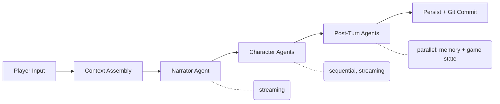

# TheAct

**An AI-driven text-based RPG engine designed for small language models.**

TheAct is a programmatic turn engine -- not an agent framework -- where code orchestrates every step of gameplay. Each turn dispatches specialized agents (narrator, characters, memory, game state) that each make exactly one focused LLM call, keeping prompts tiny and reliable. The system runs on 7B-class thinking models, proving you don't need massive models for compelling interactive fiction.

## Turn Pipeline



## Features

- **Multiple AI characters** with distinct personalities, goals, and per-character memory
- **Chapter-based story progression** with beats and completion criteria
- **Git-based save versioning** -- unlimited undo, branching, history diff
- **Autonomous playtesting** framework with quality scoring
- **Interactive turn debugger** -- step through agents, edit prompts, replay
- **Game creation agent** -- build new games through conversation
- **CLI + Web UI** -- Rich terminal interface and NiceGUI browser client

## Quick Start

```bash
uv sync
cp .env.example .env                 # Add your LLM_API_KEY, LLM_BASE_URL, LLM_MODEL
uv run python scripts/test_llm.py   # Verify LLM connection
uv run python -m theact             # Play
```

## Documentation

| Guide | Path |
|-------|------|
| Getting Started | [docs/getting-started.md](docs/getting-started.md) |
| Core Concepts | [docs/concepts.md](docs/concepts.md) |
| Architecture | [docs/architecture/overview.md](docs/architecture/overview.md) |
| Creating a Game | [docs/guides/creating-a-game.md](docs/guides/creating-a-game.md) |
| Full Documentation | [docs/README.md](docs/README.md) |

## Tech Stack

- **Python 3.11** + uv
- **Any OpenAI-compatible API** (OpenAI, OpenRouter, Together AI, Groq, Ollama, Venice AI, vLLM)
- **Pydantic v2** -- data models with strict validation
- **PyYAML** -- all data files and structured LLM output
- **GitPython** -- save versioning
- **Rich** -- terminal UI
- **NiceGUI** -- web UI (optional)

## Project Structure

```
src/theact/
  models/       Data models (Pydantic)
  io/           YAML I/O, save manager
  versioning/   Git-based save versioning
  llm/          LLM client, streaming, structured output, call logging
  engine/       Turn engine, context assembly
  agents/       Narrator, character, memory, game state, summarizer
  debugger/     Interactive turn debugger
  cli/          Rich terminal interface
  web/          NiceGUI web interface
  playtest/     Autonomous playtest framework
  creator/      Game creation agent
```
