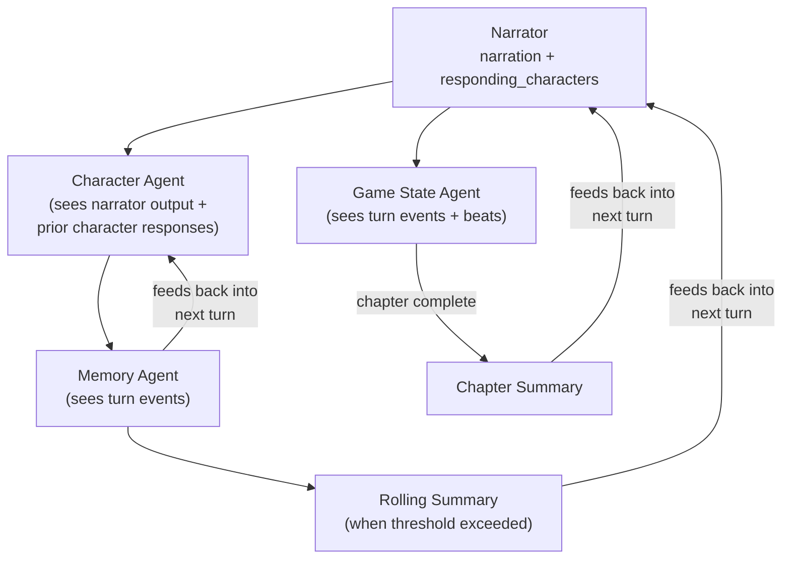

# Agents

Each agent makes exactly one LLM call to do exactly one task. The code decides which agents run and in what order — the model never decides "what to do next." All gameplay agents use the small 7B model.

## Agent Inventory

| Agent | Purpose | Output | When It Runs |
|---|---|---|---|
| **Narrator** | Describes what happens, picks responding characters | YAML: narration, responding_characters, mood | Every turn, first |
| **Character** | Responds in-character with dialogue/actions | Plain text (50-150 words) | Once per responding character, sequential |
| **Memory** | Updates one character's memory | YAML: add, remove, update facts + summary | Post-turn, parallel (one per character) |
| **Game State** | Checks chapter beat progress and completion | YAML: chapter_complete, reason, new_beats | Post-turn, parallel |
| **Chapter Summary** | Summarizes a completed chapter | Plain text (2-3 sentences) | On chapter completion |
| **Rolling Summary** | Merges old conversation into running summary | Plain text (under 5 sentences) | When unsummarized conversation exceeds ~1500 tokens |

Source: all agent implementations in `src/theact/agents/`. All prompt templates in a single file: `src/theact/agents/prompts.py`.

## Agent Interaction

Data flows forward through the turn and feeds back into subsequent turns. The narrator produces narration and selects which characters respond. Character agents run sequentially so each can see prior responses. After all responses are collected, memory and game state agents run in parallel. Summaries generated here are available to the narrator and character agents on the next turn.

## Prompt Design for Small Models

Five rules govern every prompt in the system:

1. **One task per call.** Never combine tasks. The narrator narrates. The memory agent updates memory. Separate calls.
2. **~300 token system prompts.** Every token competes with reasoning space in an 8K context window.
3. **Imperative mood.** "Write narration" not "You should write narration."
4. **Concrete examples.** Show exact output format with realistic content. Small models learn from examples more than instructions.
5. **State constraints as rules.** "Only list characters from ACTIVE CHARACTERS" not "It would be best to only include active characters."

All prompts live in `src/theact/agents/prompts.py` — a single file, by design, for quick iteration.

## Structured Output Pipeline

Agents that produce structured data (narrator, memory, game state) follow this parsing flow:

1. The prompt includes a concrete YAML example showing the exact format expected (the example is inline in the prompt template).
2. The model response passes through `extract_yaml_block()`, which finds the last fenced YAML block via regex.
3. The extracted text is parsed with `yaml.safe_load()`.
4. On parse failure, the model is retried with the error message fed back for self-correction.

Why YAML and not JSON? Small models produce more reliable YAML — multiline strings need no escaping, quotes are optional, and whitespace is forgiving. See [Concepts](../concepts.md) for the full rationale.

## Context Assembly

Each agent has a dedicated builder function that assembles its message list:

| Function | Agent | Key Inputs |
|---|---|---|
| `build_narrator_messages()` | Narrator | World, chapter context, rolling summary, recent conversation, player input |
| `build_character_messages()` | Character | Character def, memory, recent conversation, narrator output, prior character responses |
| `build_memory_messages()` | Memory | Character def, current memory, current turn entries |
| `build_game_state_messages()` | Game State | Chapter beats with hit status, current turn entries |
| `build_summary_messages()` | Chapter Summary | Chapter def, recent conversation |
| `build_rolling_summary_messages()` | Rolling Summary | Existing summary, old conversation entries |

All builders live in `src/theact/engine/context.py`. Each checks token budgets and trims conversation history if needed. See [Memory & Summarization](memory.md) for how context budgeting works.

## See Also

- [Architecture](overview.md) — where agents fit in the turn pipeline
- [Memory & Summarization](memory.md) — memory and summary agents in depth
- [Prompt Engineering](../guides/prompt-engineering.md) — tuning and iterating on prompts
