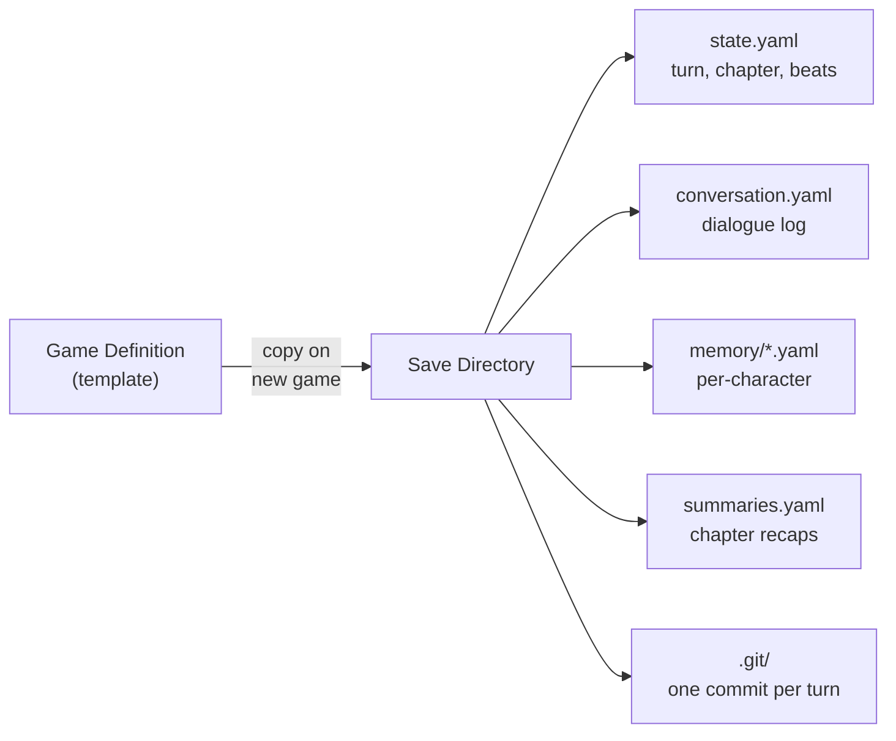

# Data Model

All data in TheAct is YAML. Game definitions are templates that ship with the game. Save files are mutable state that evolves during play. Pydantic models with `extra="forbid"` back every file.

## Game Definition Files

A game is a directory containing a manifest, world description, character definitions, and chapters:

```
games/lost-island/
  game.yaml            # GameMeta: id, title, character/chapter lists
  world.yaml           # World: setting, tone, rules
  characters/
    maya.yaml           # Character definition (~60 words)
    joaquin.yaml
  chapters/
    01-the-crash.yaml   # Chapter: beats, completion criteria, next
    02-the-discovery.yaml
    03-the-heart.yaml
```

See `games/lost-island/` for a concrete example.

### Pydantic Models

| File | Model | Key Fields |
|---|---|---|
| `game.yaml` | `GameMeta` | id, title, description, characters (list), chapters (list) |
| `world.yaml` | `World` | setting, tone, rules |
| `characters/*.yaml` | `Character` | name, role, personality, secret, relationships |
| `chapters/*.yaml` | `Chapter` | id, title, summary, beats, completion, characters, next |

All models live in `src/theact/models/`. The `extra="forbid"` setting catches typos and unexpected fields at load time.

## Size Constraints

These files are injected directly into LLM prompts. A 7B model with ~8K context cannot afford bloat:

- **Character files**: ~60 words — name, role, personality, secret, relationships
- **World file**: ~6 sentences across setting, tone, rules
- **Chapter beats**: short phrases like "Player finds radio in wreckage"

Every word in a game file costs prompt tokens. See [Requirements](../reference/requirements.md) for the full rationale behind these constraints.

## Save Files

When a player starts a new game, the game definition is copied into a save directory. Mutable state files are created alongside it.



The save directory mirrors the game definition and adds state files:

```
saves/lost-island-001/
  game.yaml, world.yaml, characters/, chapters/   (copied from template)
  state.yaml              # GameState: turn counter, current chapter, beats hit
  conversation.yaml       # List of ConversationEntry
  memory/
    maya.yaml             # CharacterMemory: summary + key facts
    joaquin.yaml
  summaries.yaml          # ChapterSummary list
  .git/                   # Git repo — one commit per turn
```

### Mutable State Models

| File | Model | Key Fields |
|---|---|---|
| `state.yaml` | `GameState` | player_name, current_chapter, turn, beats_hit, chapter_history, rolling_summary, last_summarized_turn, game_complete, flags |
| `conversation.yaml` | `ConversationEntry` (list) | turn, role (narrator/character/player), character, content |
| `memory/*.yaml` | `CharacterMemory` | summary (3-5 sentences), key_facts (max 10) |
| `summaries.yaml` | `ChapterSummary` (list) | chapter_id, title, summary |

## LoadedGame

At runtime, the engine works with `LoadedGame` — an in-memory aggregate that combines the game template with current save state. It holds:

- `GameMeta`, `World`, all `Character` instances, all `Chapter` instances
- `GameState`, the conversation log, per-character memories, and chapter summaries

`LoadedGame` is never persisted directly. It is reconstructed from the save directory on load, and its component parts are written back individually after each turn.

## I/O Layer

- **Save management**: `src/theact/io/save_manager.py` — create, load, and persist saves
- **YAML helpers**: `src/theact/io/yaml_io.py` — typed read/write wrappers around `pyyaml`

## See Also

- [Creating a Game](../guides/creating-a-game.md) for writing game files
- [Save Versioning](save-versioning.md) for git operations on save directories
- [Memory & Summarization](memory.md) for how character memories evolve
