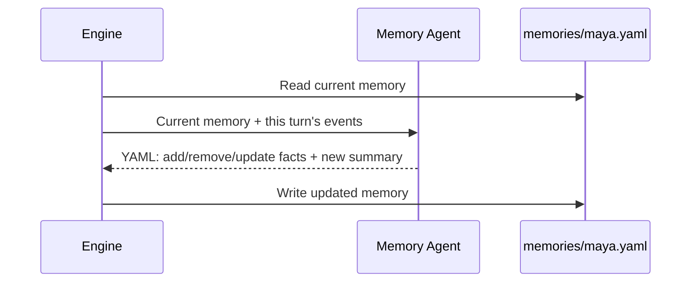
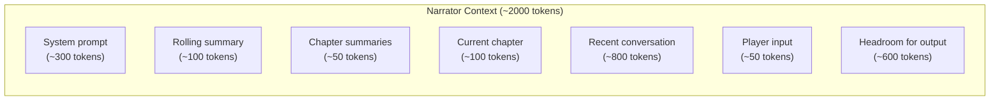

# Memory & Summarization

A 7B model has ~8K context tokens. A game can last 50+ turns, generating ~25K tokens of raw conversation. The memory and summarization systems keep context within budget without losing important story details.

## Character Memory

Each character has a memory file at `memories/<name>.yaml` containing:

- **Summary** — 3-5 sentences capturing the character's current understanding of the story
- **Key facts** — max 10 short entries tracking specific knowledge, relationships, and intentions

A dedicated memory agent updates each character's memory after every turn. The agent sees the character's current memory plus the current turn's events, and outputs a YAML diff: facts to add, remove, or update, plus a new summary.

**Critical rule:** memories are never cross-contaminated. Each memory agent sees only what that character witnessed. If Maya was not present for a conversation, her memory agent never sees it.

## Memory Update Flow

Memory agents for all characters run in parallel via `asyncio.gather`. Each agent instance is independent — no shared state, no cross-character reads.

## Rolling Summary

When unsummarized conversation exceeds ~1500 tokens, the rolling summarizer triggers:

1. The oldest turns (all except the last 4) plus the existing summary are sent to the summarizer agent.
2. The agent produces an updated summary of under 5 sentences.
3. The engine records `last_summarized_turn` in game state.
4. On the next turn, the narrator receives this summary as "Story so far" at the top of its context.

This is **incremental merge**, not full re-summarization. The agent folds new events into the existing summary rather than re-reading the entire history. This keeps each summarization call cheap and bounded.

## Chapter Summaries

When the game state agent determines a chapter is complete:

1. A chapter summary agent creates a 2-3 sentence recap of the chapter.
2. The recap is stored in `summaries.yaml`.
3. On subsequent turns, the narrator receives all chapter summaries as "COMPLETED CHAPTERS" in its context.

Chapter summaries are permanent — they are never re-summarized or trimmed.

## Context Budgeting

The narrator has the largest context window to fill. Here is how the ~2000 token budget is typically allocated:

The pattern every context builder follows:

1. Build the system prompt with all required static data (world, chapter, characters).
2. Add the user message with conversation history and player input.
3. Estimate total tokens using the `len(text) // 4` heuristic (no tiktoken dependency).
4. If over budget, trim conversation history from the oldest entries first.

## Typical Turn 30

A concrete example of what each agent sees at turn 30 of a game:

| Agent | Context Contents | Approx. Tokens |
|---|---|---|
| **Narrator** | Rolling summary (turns 1-26 in ~5 sentences) + chapter summaries + turns 27-29 + current input | ~1400 |
| **Character** | Character memory (summary + facts) + turns 28-29 + current turn (narrator output + prior responses) | ~1000 |
| **Memory** | Character's current memory + current turn events | ~600 |
| **Game State** | Chapter beats with hit/unhit status + current turn events | ~500 |

The rolling summary compresses turns 1-26 into roughly 5 sentences. The narrator sees that summary plus only the 3 most recent turns. Each character sees even less — just their own memory plus the last 2 turns and the current one.

The result: a 50-turn game uses roughly the same context as a 5-turn game. The memory and summarization systems act as a compression layer that keeps the context window stable regardless of game length.

## See Also

- [Agents](agents.md) — agent details, prompt design rules, structured output pipeline
- [Data Model](data-model.md) — memory file format and game state schema
- [Requirements](../reference/requirements.md) — design rationale behind these decisions
