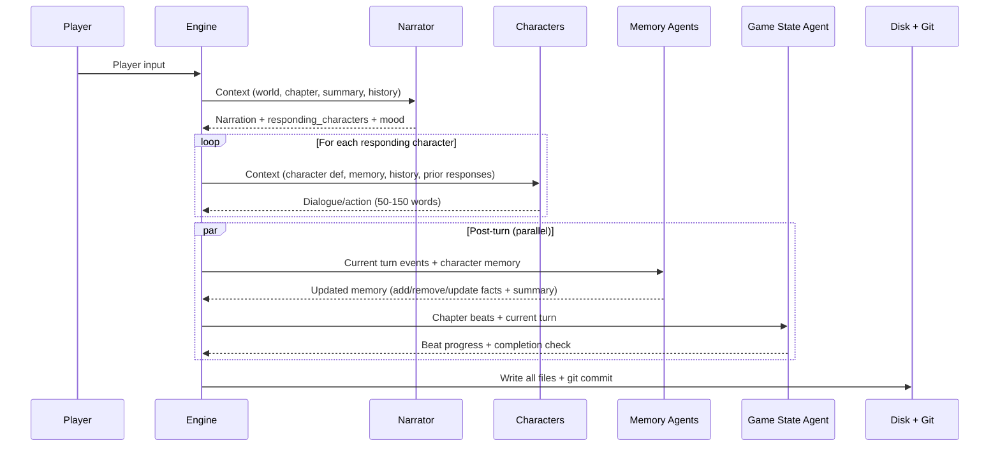
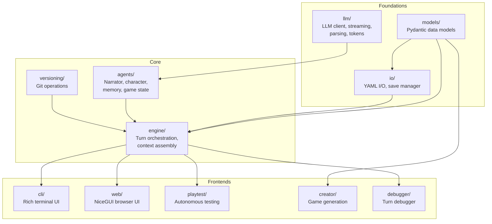

# Architecture

TheAct orchestrates text RPG turns through code. The LLM never decides what to do next — it only responds to specific, narrow tasks. This section covers how the pieces fit together.

For terminology used throughout, see [Concepts](../concepts.md).

## Turn Pipeline

The narrator streams first, producing narration text and deciding which characters should respond. Characters then respond **sequentially** — each sees all prior responses in the same turn, enabling coherent multi-character dialogue. After all responses are collected, memory updates (one per character) and the game state check run **in parallel** via `asyncio.gather()`, since they are independent of each other. Finally, all state is written to disk and committed to git.

For the full turn pipeline diagram in context, see [index.md](../README.md).

## Module Map

Dependency flow is strictly layered. **Foundations** have no business logic — they handle data shapes, LLM communication, and file I/O. **Core** builds on foundations to implement turn orchestration and agent logic. **Frontends** consume the engine and never talk to each other.

## Concurrency Model

- **Characters respond sequentially.** Each character agent sees all prior character responses from the same turn. This produces coherent multi-party dialogue instead of characters talking past each other.
- **Post-turn agents run in parallel.** Memory updates (one per character) and the game state check are independent tasks. They execute concurrently via `asyncio.gather()`.
- **All LLM calls are async.** The client wraps `AsyncOpenAI`, so the event loop is never blocked during inference.

## Streaming

LLM responses stream token-by-token through a layered callback system:

1. The LLM client yields `StreamChunk` objects as tokens arrive.
2. Each agent accepts an `on_token` callback and invokes it per chunk.
3. `run_turn()` wires agent callbacks to a `StreamCallback` type provided by the frontend.
4. The frontend implements `StreamCallback` — the CLI renders tokens via Rich, the web UI pushes them over WebSockets.

The engine has zero knowledge of UI. It only knows that someone handed it a callable to receive tokens.

## Frontends

Both the CLI and web UI consume the same `run_turn()` interface. The engine does not distinguish between them.

| Frontend | Location | Transport |
|---|---|---|
| CLI | `src/theact/cli/` | Rich terminal with inline streaming |
| Web UI | `src/theact/web/` | NiceGUI with WebSocket streaming |
| Playtest | `src/theact/playtest/` | Headless — collects output for scoring |
| Turn Debugger | `src/theact/debugger/` | Interactive — step through agents one at a time |

The playtest framework and turn debugger also consume `run_turn()`, making them first-class frontends rather than special-cased tools.

## See Also

- [Concepts](../concepts.md) for terminology
- [Agents](agents.md) for individual agent details
- [Data Model](data-model.md) for file structures
