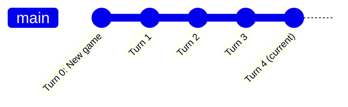

# Save Versioning

Each save directory is a git repository. One commit per turn. This gives unlimited undo, full history, and cheap storage.

## How It Works



When a player starts a new game, the save directory is initialized as a git repo. After each turn, all changed files are committed together:

- `state.yaml` — current chapter, turn number, game flags
- `conversation.yaml` — full conversation log (appended each turn)
- `memories/` — per-character memory files
- `summaries.yaml` — rolling narrative summary

Every turn is one atomic commit. No partial state.

## Undo

Use `/undo` in the CLI or web UI to revert the last turn.

Under the hood this runs `git reset --hard HEAD~1`. The conversation log, character memories, and game state all revert together — there is no partial rollback.

To undo multiple turns:

```bash
git reset --hard HEAD~N
```

where `N` is the number of turns to revert.

## History

Read any file at a historical turn:

```python
from theact.versioning import peek_at_turn

# Read state.yaml as it was at turn 5
content = peek_at_turn(save_path, turn_number=5, file_path="state.yaml")
```

Diff files between two turns:

```python
from theact.versioning import diff_turns

# See what changed between turn 3 and turn 7
diff = diff_turns(save_path, turn_a=3, turn_b=7)
```

Standard git tools also work directly on save directories — `git log`, `git diff`, `git show`, `git blame`.

## Save Forking

Create a new save from the current state:

```python
from theact.versioning import save_as

save_as(save_path, "alternate-timeline")
```

The new save is a full git clone — it retains all history from the original. Use this to branch a story at a decision point and explore different paths.

## Why Git

| Concern | Git approach | Alternative considered |
|---|---|---|
| Storage growth | Git stores diffs, not full copies | tar.gz snapshots grow linearly with game size |
| Undo | `git reset --hard HEAD~N` | Manual file-copy rollback |
| History inspection | `git log`, `git show`, `git diff` | Custom format parsing |
| Scales to hundreds of turns | Yes — only appended portions stored | Snapshot archives become expensive |

`conversation.yaml` grows linearly as turns accumulate, but git only stores the appended portion in each commit's diff. All standard git tools work on save directories without any custom tooling.

## Implementation

`src/theact/versioning/git_save.py` — uses GitPython (`gitdb`).

Key functions:

- `init_save(path)` — initialize a new save as a git repo
- `commit_turn(path, turn)` — stage all changes and commit
- `undo(path, n=1)` — reset to N turns ago
- `peek_at_turn(path, turn, file)` — read a file at a specific turn
- `diff_turns(path, a, b)` — diff between two turns
- `save_as(path, name)` — clone save to a new directory

## See Also

- [Data Model](data-model.md) — save file structure and formats
- [Getting Started](../getting-started.md) — using `/undo` during gameplay
