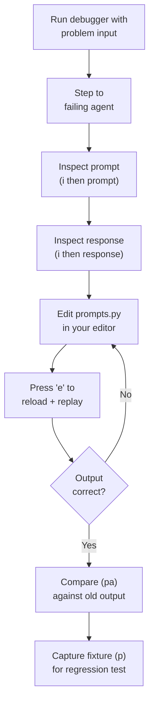

# Debugging

The turn debugger lets you step through agent calls one at a time, inspect prompts and responses, edit prompts and replay without restarting, and capture test fixtures. It wraps agents directly — calling the same `run_narrator()`, `run_character()`, etc. that `run_turn()` uses — so there is no "debugger mode" that could mask bugs.

## Quick Start

```bash
uv run python scripts/debug_turn.py --game lost-island --save my-save --input "I look around."
```

This loads the game state from the specified save, then pauses before each agent call so you can inspect and interact.

## Interactive Commands

| Command | Key | Description |
|---------|-----|-------------|
| Step | `s` | Execute current agent call, pause at next |
| Replay | `r` | Re-run current agent (same inputs, new LLM call) |
| Edit | `e` | Reload prompts from disk and replay |
| Inspect | `i` | Show prompt (`prompt`), response (`response`), parsed output (`parsed`), stats (`stats`), or all (`all`) |
| Skip | `k` | Skip current agent, move to next |
| Continue | `c` | Run all remaining agents without pausing |
| Fixture | `p` | Capture prompt/response as test fixture |
| Compare | `pa` | Compare current response against previous replay |
| Quit | `q` | Abort and exit |

## Workflow: Fixing a Prompt



## How Edit+Replay Works

The debugger uses `importlib.reload()` to hot-reload prompt changes. It must reload both `prompts.py` and `context.py` because `context.py` imports constants at import time.

The sequence on pressing `e`:

1. User edits `src/theact/agents/prompts.py` in their editor
2. Debugger reloads the prompts module
3. Debugger reloads the context module (picks up new constants)
4. Agent call replays with the updated prompt

This gives a tight edit-test loop without restarting the process or re-running earlier agents.

## Fixture Capture

Pressing `p` calls `capture_fixture()`, which saves the full `AgentResult` (messages, raw response, parsed data, tokens) as YAML in `tests/fixtures/`.

These fixtures feed into `test_prompt_regression.py` — debug a problem, capture the failing case, fix the prompt, and the captured fixture becomes a regression test.

## Replay Mode

Walk through historical turns from a save that was run with `debug=True` (uses the [diagnostics filesystem](../reference/observability.md#diagnostics-filesystem)):

```bash
uv run python scripts/debug_turn.py --save my-save --replay
```

| Key | Action |
|-----|--------|
| `Enter` | Next turn |
| `p` | Previous turn |
| `j N` | Jump to turn N |
| `d A B` | Diff turn A against turn B |
| `q` | Quit |

## Design

The debugger wraps agents, not the engine. It requires a real game save — loading game state, characters, and conversation history from a save directory. There is no mock mode. This means the debugger exercises the exact same code paths as production, so any fix validated here works in the real game loop.

## Troubleshooting

| Symptom | What to Check | Tool |
|---------|---------------|------|
| Empty narrator response | System prompt too long | Context profiler |
| Narrator outputs prose instead of YAML | YAML hint missing or weak | Inspect prompt (`i` then `prompt`) |
| Character breaks voice | Personality too vague | Check character YAML file |
| Memory agent hallucinates facts | Turn events include wrong characters | Inspect memory prompt |
| Game state never completes chapter | Completion condition too strict | Check chapter YAML file |
| Model echoes prompt back | Context overflow | Context profiler |

## Key Files

| File | Contents |
|------|----------|
| `src/theact/debugger/debugger.py` | `TurnDebugger` class |
| `src/theact/debugger/types.py` | `AgentResult`, `DebugStep`, `DebugSession` |
| `scripts/debug_turn.py` | CLI entry point |

## See Also

- [Observability](../reference/observability.md) — the logging infrastructure the debugger builds on
- [Prompt Engineering](prompt-engineering.md) — the broader iteration workflow
