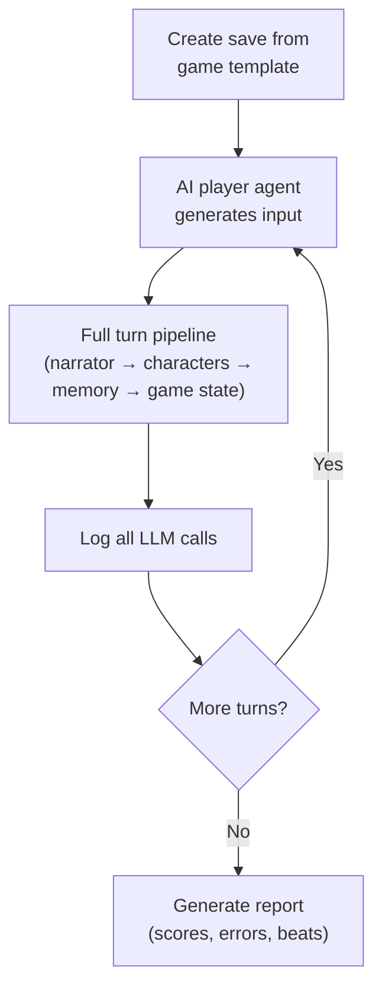

# Playtesting

The autonomous playtest framework runs an AI player agent through your game for N turns, logging every LLM call and producing a diagnostic report.

## Running a Playtest

```bash
uv run python scripts/playtest.py --game lost-island --turns 20
```

| Flag | Default | Description |
|------|---------|-------------|
| `--game` | (required) | Game ID (directory name under `games/`) |
| `--turns` | `20` | Maximum turns |
| `--player-name` | `Alex` | Player character name |
| `--stop-on-error` | off | Stop on first error |

## What Happens During a Playtest



Each turn exercises the complete pipeline — narrator, character agents, memory updates, game state checks — identical to a real player session.

## Reading the Report

The report covers five areas:

- **Turns completed** — did the playtest finish all requested turns or error out early?
- **Beats hit** — which story beats were triggered during the run?
- **Chapters advanced** — did the game progress beyond the starting chapter?
- **Errors** — parse failures, empty responses, exceptions with tracebacks.
- **LLM Call Summary** — per-agent stats: total calls, mean latency, parse success rate, token breakdown, retry counts.

## Quality Scoring

Each turn is scored on four dimensions:

| Dimension | Weight | Ideal |
|-----------|--------|-------|
| Narration length | 0.3 | 150-300 words |
| YAML first attempt | 0.2 | Parsed without retry |
| Character personality | 0.3 | Response matches personality markers |
| Memory relevance | 0.2 | Updates reference actual turn events |

The composite score (0.0-1.0) appears in the report summary.

## Edge Case Injection

The AI player agent injects stress-test inputs at configurable frequencies:

| Type | Default Rate | Example |
|------|-------------|---------|
| Direct strings | 5% | "ok", "yes", nonsense |
| Nonsensical input | 3% | Random characters, repeated text |
| Repeat action | 3% | Same action as previous turn |

Configure via `PlaytestConfig` fields.

## Common Issues

| Symptom | Likely Cause | Fix |
|---------|-------------|-----|
| Empty narrator responses | System prompt too long | Trim world/chapter text |
| Malformed YAML | Model ignores format | Strengthen prompt example |
| Repetitive narration | Stale rolling summary | Check summary thresholds |
| Characters break voice | Vague personality | Add specific speech patterns |
| No beats hit | Beats too specific | Simplify beat phrases |
| Game stuck on chapter | Completion too strict | Loosen chapter YAML |

## Golden Scenarios

Scripted multi-turn behavioral tests with structural assertions. They sit between unit tests (too narrow) and full playtests (too broad) — each tests one behavior in 3-5 turns.

### Running Scenarios

```bash
uv run python scripts/run_golden.py                           # All scenarios
uv run python scripts/run_golden.py --scenario crash_opening   # Single scenario
```

### Scenario Format

```yaml
name: Crash Opening Sequence
description: First 3 turns produce coherent crash scene
game: lost-island
turns:
  - input: null          # null = opening narration
    expect:
      narrator_not_empty: true
  - input: "I look for survivors."
    expect:
      narrator_not_empty: true
      characters_responded_min: 1
```

Scenarios live in `tests/golden_scenarios/`.

### Available Assertions

| Assertion | Type | Description |
|-----------|------|-------------|
| `narrator_not_empty` | bool | Narration is non-empty |
| `narrator_word_count_min` | int | Minimum narration words |
| `narrator_word_count_max` | int | Maximum narration words |
| `characters_responded_min` | int | Min characters responded |
| `characters_responded_max` | int | Max characters responded |
| `characters_responded_includes` | list | Specific character IDs that must respond |
| `beats_hit_any` | bool | At least one beat hit |
| `beats_hit_count_min` | int | Minimum beats hit |

All assertions are structural (counts, presence) — not text content. Deterministic across model runs.

### Existing Scenarios

| File | Tests |
|------|-------|
| `crash_opening` | Opening narration and first interactions |
| `maya_dialogue` | Direct character interaction triggers response |
| `short_input` | Handles minimal inputs without crashing |
| `adversarial_input` | Meta-gaming, gibberish produce valid narration |
| `both_characters` | Group interaction elicits multiple responses |

### Writing New Scenarios

- Keep to 3-5 turns per scenario.
- Use structural assertions only (never assert on exact text).
- Test one behavior per scenario.
- Use `null` input for opening turns.

## See Also

- [Prompt Engineering](prompt-engineering.md) for fixing issues playtests reveal
- [Creating a Game](creating-a-game.md) for game file constraints
- [Observability](../reference/observability.md) for call logging details
