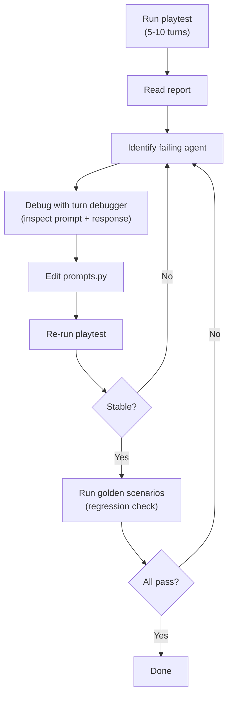

# Prompt Engineering

When the model misbehaves during playtesting, the fix is almost always a prompt change. This guide covers the iteration loop, common fixes, A/B testing, and model quirks.

## Where Prompts Live

All templates in a single file: `src/theact/agents/prompts.py`. By design --- one-line edits, not multi-file refactors. Constants are imported by context assembly (`src/theact/engine/context.py`).

## The Iteration Loop



## Rules for Small Models

Follow the five prompt design rules defined in [Agents — Prompt Design](../architecture/agents.md#prompt-design-for-small-models): one task per call, ~300 token system prompts, imperative mood, concrete examples, and constraints stated as rules. Read that section before editing prompts.

## Common Fixes

### Model outputs prose instead of YAML

- Ensure the YAML example uses realistic content, not placeholders.
- Strengthen the YAML hint (`YAML_HINT_*` constants in `prompts.py`).
- Check the system prompt is not too long --- the model may be losing the format instruction.

### Character breaks voice

- Add specific speech patterns to the `personality` field.
- Add anti-patterns ("Never uses slang").

### Narrator skips beats

- Simplify beat text ("Player finds supplies" not elaborate descriptions).
- Check beat phrasing describes natural events the narrator can weave in.

### Memory agent hallucinates facts

- Add a concrete negative example to the prompt.
- Verify turn entries only include events the character witnessed.

### Game state never completes chapter

- Usually a game file issue --- loosen the `completion` field.
- Check the completion condition matches the beat set.

## Turn Debugger

The fastest way to iterate. Step to the failing agent, inspect the prompt and response, edit, reload. See [Debugging](debugging.md) for full details.

## A/B Testing

Compare prompt variants statistically to remove guesswork.

### Quick Start

```bash
cp src/theact/agents/prompts.py src/theact/agents/prompts_v2.py
# Edit prompts_v2.py

uv run python scripts/ab_test.py \
  --game lost-island --turns 10 \
  --variant-a current --variant-b src/theact/agents/prompts_v2.py \
  --runs 3
```

### How It Works

For each run: load variant, monkey-patch prompts, run playtest, restore. Uses `random.seed(run_number)` so the AI player produces the same inputs across variants.

### Metrics Compared

| Metric | Description |
|--------|-------------|
| YAML parse success | % of calls producing valid YAML |
| Character response rate | % of turns with at least one character response |
| Avg narration word count | Mean narrator output length |
| Avg thinking tokens | Mean reasoning tokens per call |
| Total tokens | All tokens consumed |
| Mean turn latency | Average wall-clock per turn |
| Beats hit | Total story beats triggered |
| Quality composite | Weighted overall score |

### Interpreting Results

Better prompts = higher parse success + response rate, lower thinking tokens, similar or higher composite. Reliability comes first --- a variant that improves thinking tokens but drops parse success is worse.

### Tips

- Start with `--turns 3 --runs 2` for fast iteration.
- Change one thing at a time.
- Use `--variant-a current` consistently as the baseline.
- Check the per-run breakdown --- averages hide variance.

## Model Quirks

Known 7B model behaviors are documented in [model-quirks.yaml](../reference/model-quirks.yaml). Check before debugging --- your issue may have a known workaround.

## See Also

- [Debugging](debugging.md) for the turn debugger
- [Playtesting](playtesting.md) for playtest reports
- [Agents](../architecture/agents.md) for agent details
- [Observability](../reference/observability.md) for error taxonomy
