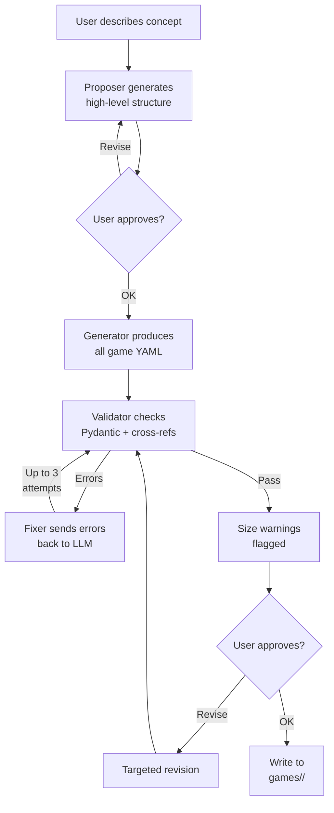

# Game Creation Pipeline

The creator agent is a multi-step pipeline that generates a complete game from a free-text concept description. Unlike gameplay agents (7B model), the creator uses a larger, more capable model.

For using the creator, see [Creating a Game](../guides/creating-a-game.md). This doc covers the internal design.

## Pipeline Overview



## Module Responsibilities

All modules live in `src/theact/creator/`.

| Module | Role |
|---|---|
| `session.py` | Orchestrates the full interactive flow |
| `proposer.py` | Generates and revises high-level proposals |
| `generator.py` | Produces full game YAML from approved proposal |
| `validator.py` | Pydantic model validation + cross-reference checks |
| `fixer.py` | Feeds validation errors back to LLM for correction |
| `writer.py` | Writes validated files to disk |
| `display.py` | Rich-formatted display of proposals, files, errors |
| `prompts.py` | All prompt templates (proposal, generation, fix, revision) |
| `config.py` | LLM config with `CREATOR_*`/`LLM_*` env var fallback |

## Two-Phase LLM Interaction

### Phase 1: Proposal

The proposer generates a high-level structure from the user's concept description:

- Title and game ID
- Setting, tone, narrative rules
- Character list (names, roles, key traits)
- Chapter list (titles, summaries, beat outlines)

This is lightweight YAML (~30 lines) meant for quick user review before committing to full generation. If the user requests changes, the current proposal and their feedback are sent back to the LLM for revision.

### Phase 2: Generation

The generator produces ALL game files in a single YAML block — `game.yaml`, `world.yaml`, all character files, and all chapter files. The approved proposal is included in the prompt as the structural blueprint.

Up to 3 retry attempts on YAML parse failure.

## Validation

Two layers run on the generated output:

**Pydantic model validation** — each file is validated against its data model. `extra="forbid"` on all models catches unexpected fields and typos.

**Cross-reference checks:**

- Characters listed in `game.yaml` must have corresponding files in `characters/`
- Chapter `next` chains must reference valid chapter IDs
- Relationship keys in character files must reference valid character IDs
- No circular chapter chains

## Auto-Fix Loop

When validation fails:

1. Validation errors + current YAML are sent to the LLM
2. The LLM returns corrected YAML
3. Validation runs again
4. Up to 3 fix attempts before giving up

If a fix attempt produces unparseable YAML, the previous valid data is preserved rather than overwritten.

## Size Warnings

The validator flags (but does not reject) files that exceed recommended limits:

| Check | Threshold |
|---|---|
| `world.yaml` word count | > 150 words |
| Character file word count | > 80 words |
| Chapter beat count | < 4 or > 6 beats |
| Individual beat length | > 15 words |

These are warnings, not errors. The user can choose to revise or accept.

## How game-id Works

The LLM chooses the game ID during the proposal phase as a URL-safe slug derived from the concept. This ID flows unchanged through:

```
proposal → generation → validation → directory name
```

There is no code-side slugification — the LLM is prompted to produce a valid slug directly. If a directory with that ID already exists, the user is asked for overwrite confirmation.

## Configuration

| Env var | Fallback | Default |
|---|---|---|
| `CREATOR_BASE_URL` | `LLM_BASE_URL` | `https://api.openai.com/v1` |
| `CREATOR_API_KEY` | `LLM_API_KEY` | (required) |
| `CREATOR_MODEL` | `LLM_MODEL` | (none) |

A warning is printed if the resolved model is the 7B gameplay model (`olafangensan-glm-4.7-flash-heretic`), since game creation benefits from a larger model's ability to produce consistent, well-structured YAML across multiple files.

## See Also

- [Creating a Game](../guides/creating-a-game.md) — user-facing guide for game creation
- [Data Model](../architecture/data-model.md) — file format specifications
- [Agents](../architecture/agents.md) — gameplay agents (separate from the creator pipeline)
