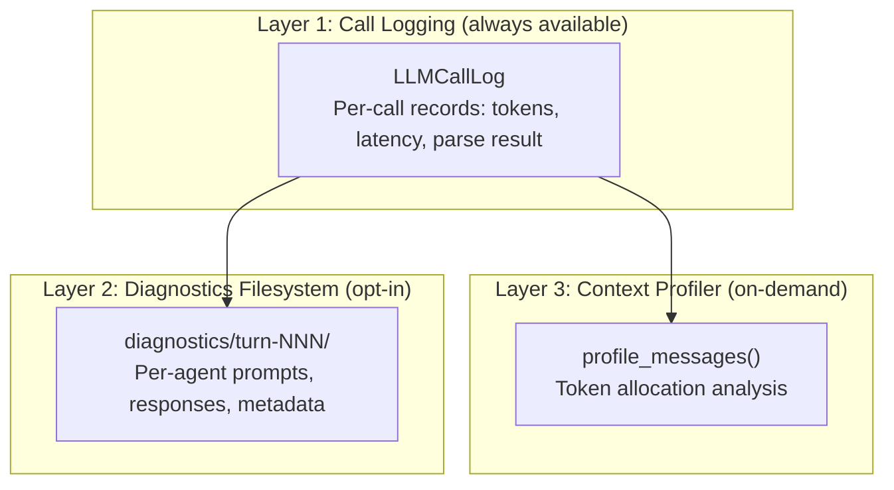

# Observability & Diagnostics

TheAct provides three layers of observability, from always-on to on-demand. All instrumentation is passive — it never changes prompts, never alters agent behavior, and never adds overhead unless opted in.

## Three-Layer Stack



Each layer builds on the one below. Call logging captures raw data. The diagnostics filesystem writes that data (plus prompts and responses) to disk for inspection. The context profiler analyzes token allocation to find budget problems.

## Call Logging

Every LLM call produces an `LLMCallRecord` with the following fields:

| Field | Description |
|-------|-------------|
| `timestamp` | When the call started |
| `agent` | Which agent (`narrator`, `character-maya`, `memory-maya`, etc.) |
| `turn` | Turn number |
| `prompt_tokens` | Tokens in the prompt |
| `thinking_tokens` | Tokens used for model reasoning |
| `content_tokens` | Response content tokens |
| `latency_ms` | Wall-clock time |
| `finish_reason` | Why the model stopped (`stop`, `length`) |
| `parse_result` | Success or failure type |
| `parse_attempts` | Parse attempts before success |
| `retry_count` | Full retries needed |
| `temperature` | Temperature used |
| `max_tokens` | Max tokens budget |

### Usage

```python
from theact.llm.call_log import LLMCallLog

call_log = LLMCallLog()
await run_turn(state, player_input, call_log=call_log)

call_log.summary()         # Aggregate stats
call_log.agent_summary()   # Stats by agent
call_log.dump_yaml(path)   # Write to YAML
```

The log is a flat list, not a nested tree. Post-turn agents run concurrently, so a flat structure avoids locking and ordering assumptions. Filtering by turn or agent is a one-liner.

## Diagnostics Filesystem

Pass `debug=True` to `run_turn()` to write per-agent artifacts to disk:

```
diagnostics/turn-001/
  narrator/
    system_prompt.txt     # Raw system prompt
    user_message.txt      # User message
    raw_response.txt      # Full model output
    call_record.yaml      # Tokens, latency, parse result
  character-maya/
    ...
  memory-maya/
    ...
  game_state/
    ...
  summary.yaml            # Turn-level aggregates
```

Plain text for prompts and responses (readable with `cat`/`less`), YAML for metadata, one directory per agent for easy diffing between turns. Files, not a database — the consumer is a human with Unix tools.

## Error Taxonomy

Every `YAMLParseError` carries a `failure_type` field from this canonical set of seven types. Each maps to a different fix strategy — lumping types would hide whether the model is ignoring instructions or trying and failing.

| Type | What Happened | Fix Direction |
|------|---------------|---------------|
| `empty_response` | Model produced nothing | Check `max_tokens`, check for context overflow |
| `no_yaml_block` | Model wrote prose, no YAML | Strengthen YAML format instruction in prompt |
| `invalid_yaml` | YAML syntax is broken | `repair_yaml_text` fallback handles most cases; simplify expected structure if persistent |
| `wrong_schema` | Valid YAML, wrong fields | Update example in prompt to match expected schema |
| `json_instead` | Model output JSON not YAML | Add "Output YAML, not JSON" rule to prompt |
| `echo_prompt` | Model echoed the prompt | Reduce prompt size, check for context overflow |
| `truncated` | Response cut off mid-YAML | Increase `max_tokens` or reduce prompt size |

These types appear in call logs, diagnostics files, and playtest reports.

## Context Profiler

Analyze token allocation for any agent's messages:

```python
from theact.llm.profiler import profile_messages, format_profile

profile = profile_messages("narrator", messages, max_tokens_budget=2000)
print(format_profile(profile))
```

Prints token allocation per message component, a visual bar showing usage, and remaining headroom. Use this to find which part of a prompt is consuming the budget.

## Prompt Linting

Automated tests in `tests/test_prompt_lint.py` enforce:

- System prompts are 300 tokens or fewer (template form)
- Rendered narrator prompts are 400 tokens or fewer (with real game data)
- No orphan `{placeholder}` strings survive rendering
- All agents have headroom >= 0 with real game data

These run as part of the standard test suite and catch budget regressions before they reach the model.

## Key Files

| File | Contents |
|------|----------|
| `src/theact/llm/call_log.py` | `LLMCallRecord`, `LLMCallLog` |
| `src/theact/engine/diagnostics.py` | Diagnostics filesystem writer |
| `src/theact/llm/profiler.py` | `profile_messages()`, `format_profile()` |
| `src/theact/llm/errors.py` | `YAMLParseError`, `ParseFailureType` |
| `tests/test_prompt_lint.py` | Prompt budget enforcement |

## See Also

- [Debugging](../guides/debugging.md) — interactive debugging built on this instrumentation
- [Prompt Engineering](../guides/prompt-engineering.md) — using diagnostics to fix prompts
- [Agents](../architecture/agents.md) — the agent calls being observed
